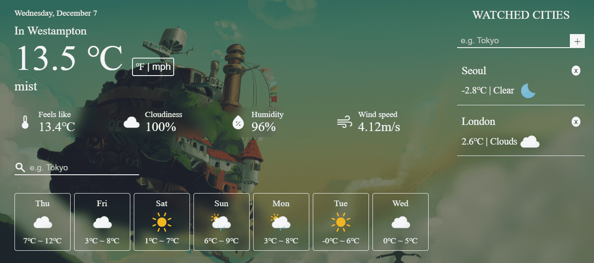
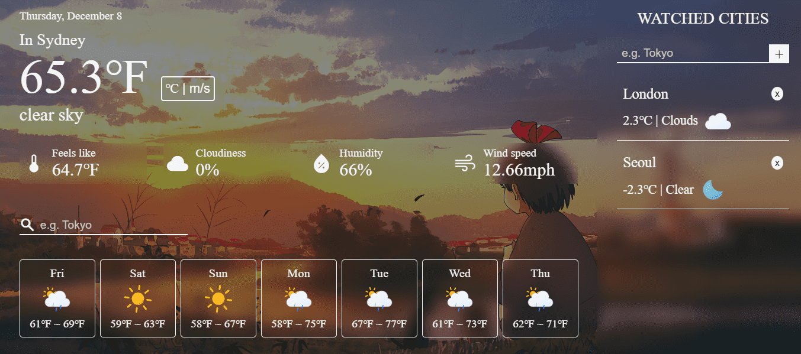

# Weather Link

A Weather App built with HTML, CSS, Javascript and Webpack for TheOdinProject

## Features

- **Geolocation** 
  Get the weather of your current location by allowing location access 

- **Watched Cities** 
  Add multiple cities to watch their weather 

- **Dynamic Background** 
  Background image changes according to the weather of the place 

- **Search Cities** 
  Search cities to get their weather details 

- **Change Units** 
  Toggle between units as per your need 

- **Daily Forecast** 
  See the upcoming week days weather 

- **Simple UI** 
  A simple yet modern UI! (Special treat to Ghibli fans💜) 

## Learnings

- Event loop
- Callback, Promises
- Async Await along with error handling
- Geolocation API, JSON revisited
- Implementing Glassmorphism using css
- overflow-wrap property in css
- A little bit of regex

## Preview

### Weather in Celsius

### Weather in Fahrenheit

## Demo

👉 [Live Demo](https://ruchita1010.github.io/weather-link)
